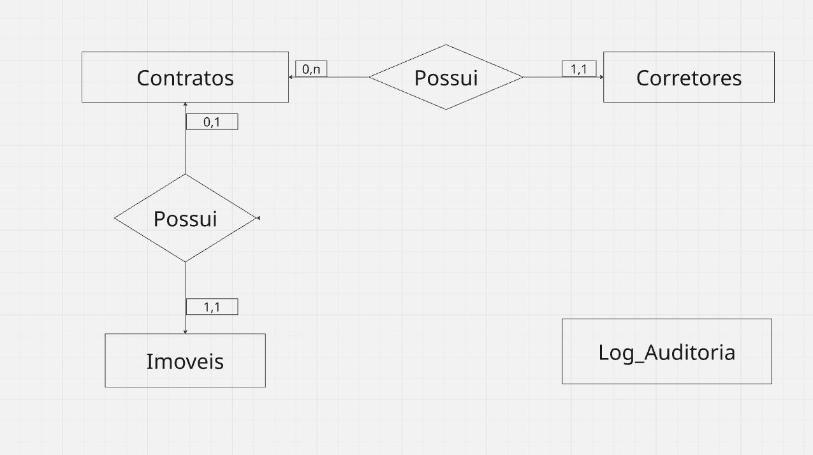

# 🏢 Backend de Automação e Gestão Imobiliária

🚧 **Status do Projeto:** Em desenvolvimento (Fase de Modelagem Concluída)

Backend relacional em **MySQL** projetado para gestão imobiliária. O sistema foca em garantir a integridade da informação, prevenindo conflitos de locação e preparando a base para automações de auditoria e atualização de contratos.

## 🎯 O Problema de Negócio
Corretores e clientes frequentemente perdem tempo e recursos oferecendo ou visitando imóveis que já foram alugados. Isso ocorre devido à falta de sincronia entre os sistemas internos de gestão e a realidade comercial, além da dependência de atualizações manuais. A ausência de um histórico de rastreabilidade (logs) também gera insegurança sobre quem alterou o status de um imóvel e quando.

## 💡 A Solução Técnica
Para resolver essa dessincronização e mitigar falhas humanas, este projeto transfere a responsabilidade das regras de negócio críticas para o motor do banco de dados, implementando:
* **Integridade Relacional (Constraints):** Bloqueios a nível de banco de dados que impedem o cadastro de novos contratos para imóveis que não estejam com o status "Disponível".
* **Rastreabilidade (Planejado):** Criação de Triggers para capturar mudanças de status e armazenar automaticamente na tabela de log isolada.
* **Automação Financeira (Planejado):** Stored Procedures para rodar rotinas diárias de verificação e atualização de contratos inadimplentes.

## 🏗️ Arquitetura de Dados

A arquitetura foi desenhada para garantir o isolamento do histórico de auditoria. A tabela `Log_Auditoria` possui apenas relacionamentos lógicos (sem chaves estrangeiras físicas), garantindo que o histórico permaneça intacto mesmo em caso de exclusão (DELETE) de imóveis ou corretores.

### Diagrama de Entidade-Relacionamento (DER)

### Modelo Físico (EER)

## ⚙️ Tecnologias e Ferramentas
* **SGBD:** MySQL
* **Modelagem:** MySQL Workbench, dbdiagram.io
* **Linguagem:** SQL (DDL, DML, TCL)

## Lógica de Negócio Implementada

O sistema utiliza Stored Procedures para automação financeira. A rotina sp_atualiza_faturas_atrasadas realiza a varredura diária das faturas pendentes, comparando a data_vencimento com a data atual do servidor (CURDATE), garantindo que a inadimplência seja sinalizada em tempo real sem intervenção manual.

## 📋 Roadmap do Projeto
- [x] Modelagem Conceitual (DER) e Definição de Regras de Negócio
- [x] Modelagem Física (EER)
- [x] Criação do Schema e Constraints DDL (`01_schema_ddl.sql`)
- [ ] Desenvolvimento da Trigger de Auditoria (`02_triggers.sql`)
- [ ] Desenvolvimento da Stored Procedure de Vencimentos (`03_procedures.sql`)
- [ ] Script de simulação de carga de dados e testes de estresse
