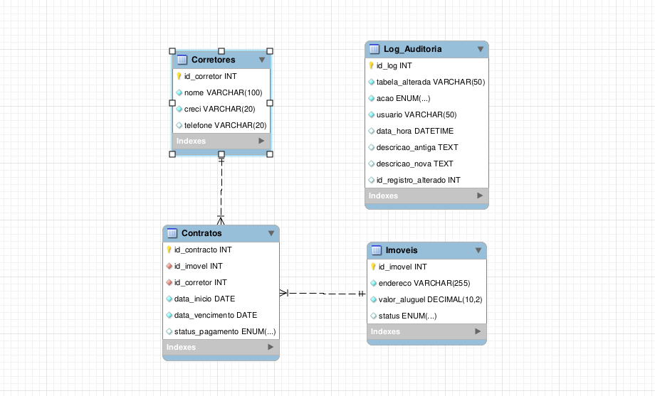

🏢 Backend de Automação e Gestão Imobiliária
Um banco de dados relacional construído em MySQL para resolver o problema de dessincronização de status de imóveis e automatizar auditorias de contratos em imobiliárias.

O Problema de Negócio:

Explique em um parágrafo o cenário: Corretores perdem tempo oferecendo imóveis já alugados porque o sistema depende de atualização humana. A falta de histórico de mudanças gera insegurança.

A Solução Técnica:

Liste o que você construiu no motor do banco para resolver isso:

Integridade Relacional: Constraints que impedem o cadastro de contratos para imóveis indisponíveis.

Triggers de Auditoria: Rastreamento automático de qualquer alteração de status (Log_Auditoria).

Stored Procedures: Rotinas de automação para atualização de status financeiro.

A Arquitetura (Insira suas imagens aqui):

Exiba o seu EER gerado no Workbench aqui. A sintaxe no markdown é:

Tecnologias Utilizadas:

MySQL, MySQL Workbench, Python (para simulação de integração).
